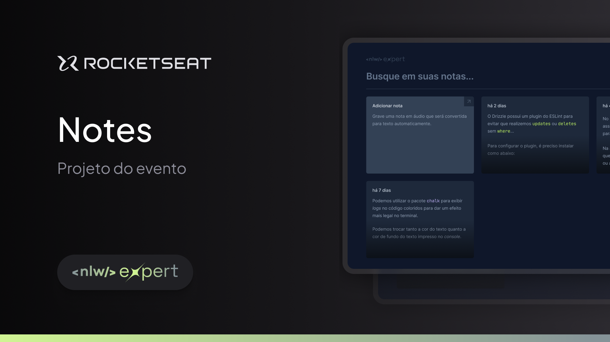

<h1 align="center" >
  
<h1>
  
</h1>
  
Escreva ou grave um audio para suas notas

</h1>

# Projeto ReactJS NLW-Expert

## Sobre
Este é um projeto ReactJS para registrar notas, pode servir de lembretes, registrar qualquer coisa que deseja, 
como descrever uma rotina etc...

## Início Rápido

Siga estas instruções para obter uma cópia do projeto e executá-lo em sua máquina local para desenvolvimento e testes.

### Pré-requisitos

Certifique-se de ter Node.js e npm instalados em sua máquina.

### Instalação

1. Clone o repositório: https://github.com/gabrielodeveloper/nlw-expert-web

2. Navegue até o diretório do projeto:

3. Instale as dependências:

### `npm install`

4. No diretório do projeto, você pode executar os seguintes comandos para executar o projeto:

### `npm run dev`

5. Abra o navegador e acesse [http://localhost:5173](http://localhost:5173) para ver o projeto em execução.

## Licença

Este projeto é licenciado sob a Licença MIT - veja o arquivo [LICENSE.md](LICENSE.md) para mais detalhes.